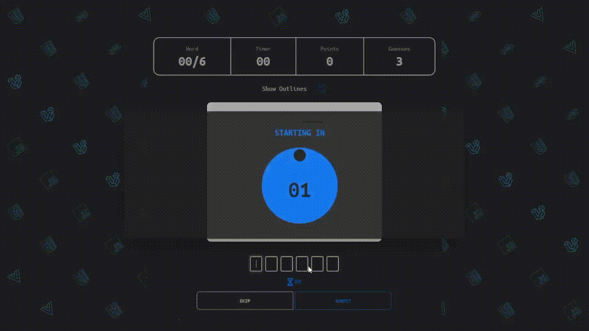
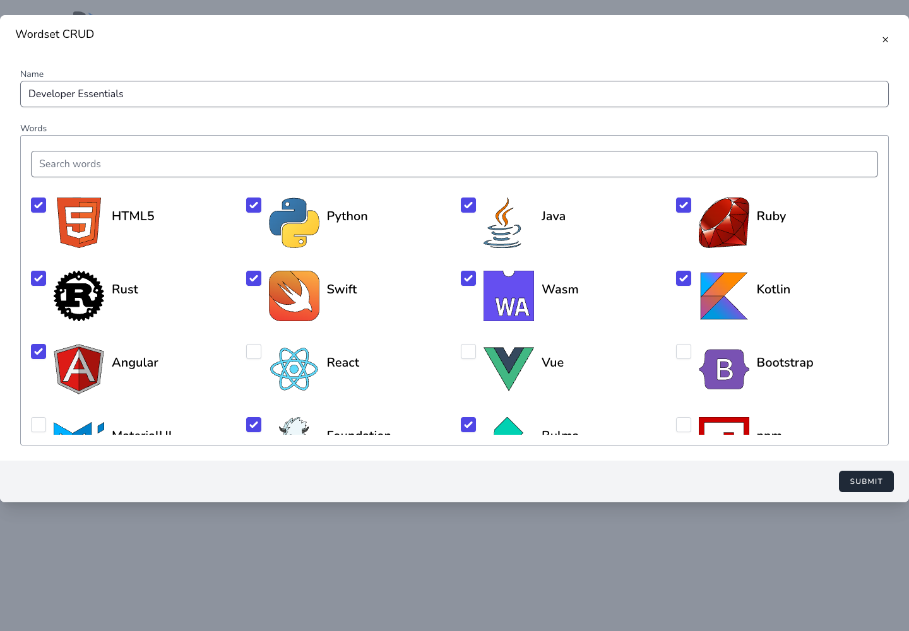
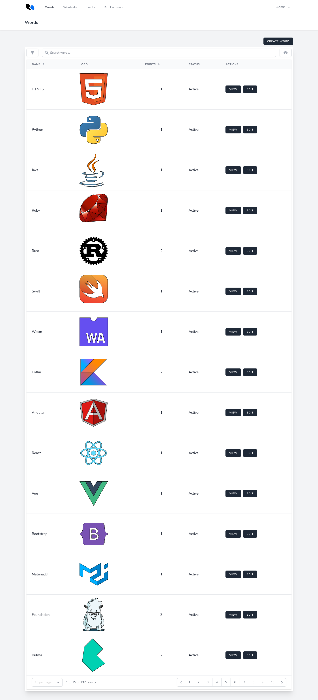

# Logo Trivia

**A timed technology-logo guessing game for events, communities, and curious developers.**

Logo Trivia challenges players to identify familiar technology logos before the clock runs out. Organizers can curate logo collections, tailor events, manage players, and track results from a focused admin workspace.

## Highlights

- Timed, SVG-powered gameplay with animated logo reveals, hints, and score tracking
- Curated logo collections with three difficulty/point tiers
- Event setup with registration, player invitations, and leaderboard controls
- Admin workflows for managing logos, collections, events, and players
- Responsive game experience built for phones and suitable for local desktop development

## Gameplay

Each round draws a technology logo as the timer counts down. Players can reveal outlines, use hints, and submit up to three guesses.



## Build logo collections

Create a tailored collection for each event by choosing the logos players will see. Include at least seven active logos from every point tier to run a full game.



## Manage logos

The admin catalogue lets organizers review, edit, activate, and organize the available technology logos.



## Technology

- Laravel 10, Jetstream, Sanctum, and Eloquent
- Vue 3 and Inertia.js
- Tailwind CSS, DaisyUI, and Vite
- SQLite for the included Herd local setup; MySQL is also supported by the application configuration

## Local setup with Laravel Herd

### Prerequisites

- Laravel Herd with PHP 8.3 selected for this project
- Node.js 18 or newer
- Composer

### Install

```bash
git clone <repository-url> logo-trivia
cd logo-trivia

herd link logo-trivia
herd isolate 8.3

herd composer install
npm ci

cp .env.example .env
touch database/database.sqlite
```

Set these values in `.env`:

```dotenv
APP_NAME="Logo Trivia"
APP_URL=http://logo-trivia.test
APP_DEBUG=false

DB_CONNECTION=sqlite
DB_DATABASE=/absolute/path/to/logo-trivia/database/database.sqlite
```

Then initialize the application:

```bash
herd php artisan key:generate
herd php artisan migrate --seed
herd php artisan storage:link
npm run build
```

Open [http://logo-trivia.test](http://logo-trivia.test). For frontend development, use `npm run dev` instead of the production build.

### Development administrator

The database seeder creates a local administrator:

```text
URL:      http://logo-trivia.test/admin/login
Email:    See database/seeders/UserSeeder.php
Password: phprocks
```

These credentials are for the seeded local database only. Change them before using any shared deployment.

## Running a game

1. Sign in to the admin workspace.
2. Create a logo collection containing at least seven active logos from each point tier.
3. Create an active event, link the collection, and enable player registration.
4. Register a player from the event page or manage players from the admin workspace.
5. Start the game from the player’s invite URL. Players have three guesses per logo and may use available hints.

## Contributors

- Harsh Bachawat — Developer

## License

This project is released under the MIT License.
